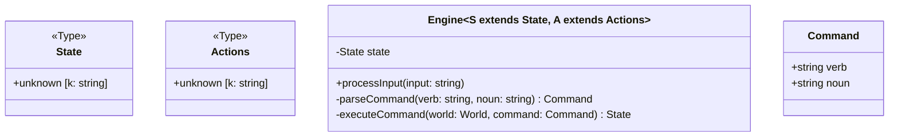

# text-adventure-engine

```mermaid
classDiagram
class State {
  <<Type>>
  +unknown [k: string]
}
class Actions {
  <<Type>>
  +unknown [k: string]
}
class Engine~S extends State, A extends Actions~ {
  -State state
  +processInput(input: string)
  -parseCommand(verb: string, noun: string) Command
  -executeCommand(world: World, command: Command) State
}
class Command {
  +string verb
  +string noun
}
```
