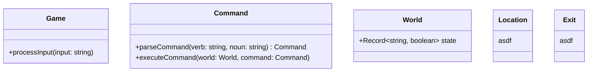

# text-adventure-engine

```mermaid
classDiagram
class Game {
  +processInput(input: string)
}
class Command {
  +parseCommand(verb: string, noun: string) Command
  +executeCommand(world: World, command: Command)
}
class World {
  +Record~string, boolean~ state
}
class Location {
  asdf
}
class Exit {
  asdf
}
```
