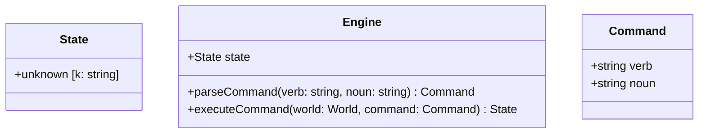

# text-adventure-engine

```mermaid
classDiagram
class State {
  +unknown [k: string]
}
class Engine {
  +State state
  +parseCommand(verb: string, noun: string) Command
  +executeCommand(world: World, command: Command) State
}
class Command {
  +string verb
  +string noun
}
```
