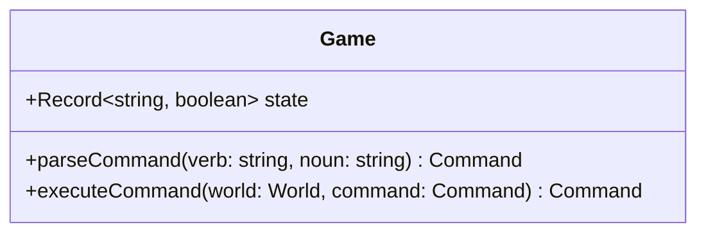

# text-adventure-engine

```mermaid
classDiagram
class Game {
  +Record~string, boolean~ state
  +parseCommand(verb: string, noun: string) Command
  +executeCommand(world: World, command: Command) Command
}
```
