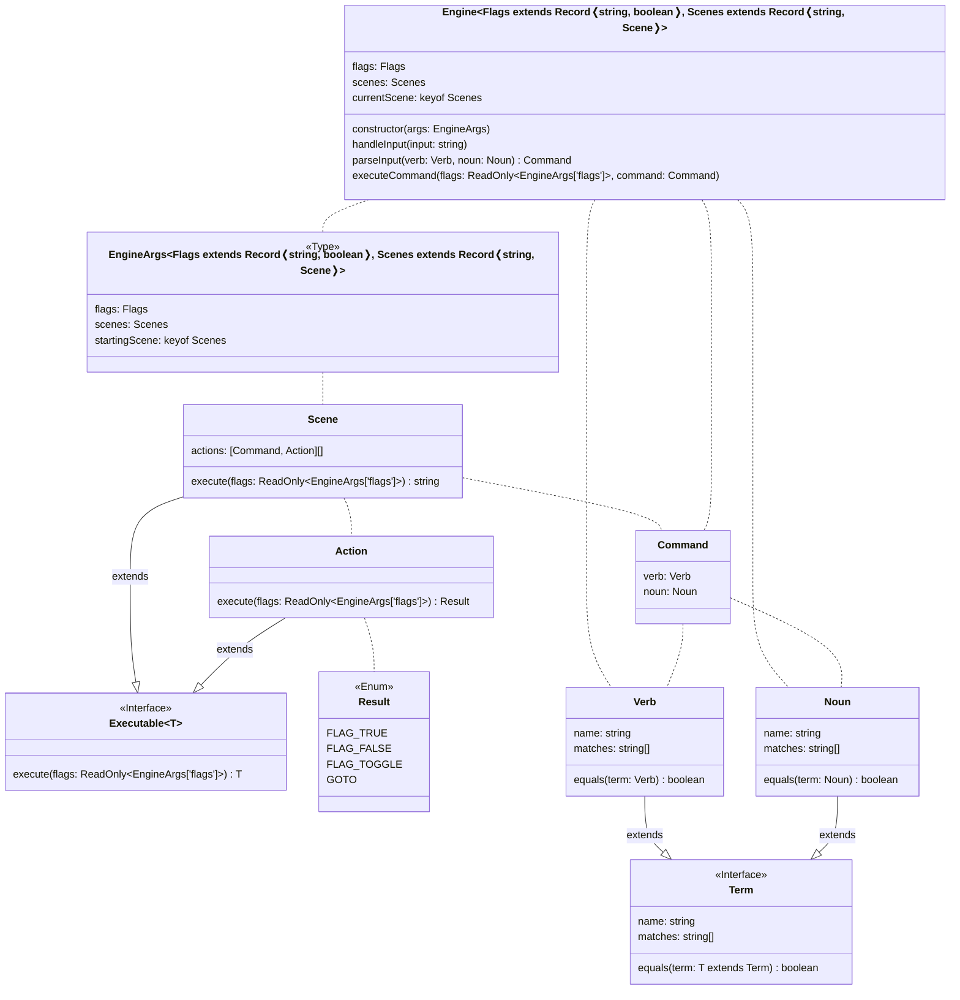

# text-adventure-engine

```mermaid
classDiagram
class EngineArgs~Flags extends Record❬string, boolean❭, Scenes extends Record❬string, Scene❭~ {
  <<Type>>
  flags: Flags
  scenes: Scenes
  startingScene: keyof Scenes
}
EngineArgs .. Scene
class Executable~T~ {
  <<Interface>>
  execute(flags: ReadOnly~EngineArgs['flags']~) T
}
class Scene {
  actions: [Command, Action][]
  execute(flags: ReadOnly~EngineArgs['flags']~) string
}
Scene .. Command
Scene .. Action
Scene --|> Executable : extends
class Action {
  execute(flags: ReadOnly~EngineArgs['flags']~) Result
}
Action .. Result
Action --|> Executable : extends
class Result {
  <<Enum>>
  FLAG_TRUE
  FLAG_FALSE
  FLAG_TOGGLE
  GOTO
}
class Engine~Flags extends Record❬string, boolean❭, Scenes extends Record❬string, Scene❭~ {
  flags: Flags
  scenes: Scenes
  currentScene: keyof Scenes
  constructor(args: EngineArgs)
  handleInput(input: string)
  parseInput(verb: Verb, noun: Noun) Command
  executeCommand(flags: ReadOnly~EngineArgs['flags']~, command: Command)
}
Engine .. EngineArgs
Engine .. Verb
Engine .. Noun
Engine .. Command
class Command {
  verb: Verb
  noun: Noun
}
Command .. Verb
Command .. Noun
class Term {
  <<Interface>>
  name: string
  matches: string[]
  equals(term: T extends Term) boolean
}
class Verb {
  name: string
  matches: string[]
  equals(term: Verb) boolean
}
Verb --|> Term : extends
class Noun {
  name: string
  matches: string[]
  equals(term: Noun) boolean
}
Noun --|> Term : extends
```
