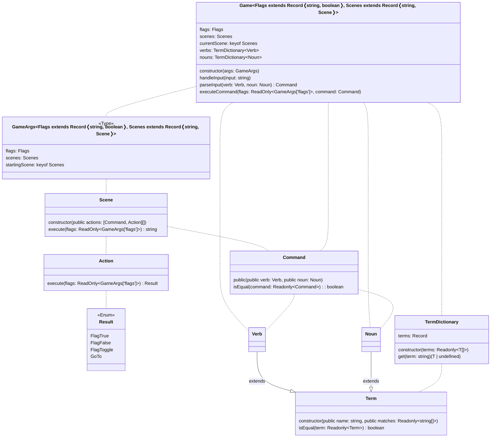

# text-adventure-engine

```mermaid
classDiagram
class GameArgs~Flags extends Record❬string, boolean❭, Scenes extends Record❬string, Scene❭~ {
  <<Type>>
  flags: Flags
  scenes: Scenes
  startingScene: keyof Scenes
}
GameArgs .. Scene
class Scene {
  constructor(public actions: [Command, Action][])
  execute(flags: ReadOnly~GameArgs['flags']~) string
}
Scene .. Command
Scene .. Action
class Action {
  execute(flags: ReadOnly~GameArgs['flags']~) Result
}
Action .. Result
class Result {
  <<Enum>>
  FlagTrue
  FlagFalse
  FlagToggle
  GoTo
}
class Game~Flags extends Record❬string, boolean❭, Scenes extends Record❬string, Scene❭~ {
  flags: Flags
  scenes: Scenes
  currentScene: keyof Scenes
  verbs: TermDictionary~Verb~
  nouns: TermDictionary~Noun~
  constructor(args: GameArgs)
  handleInput(input: string)
  parseInput(verb: Verb, noun: Noun) Command
  executeCommand(flags: ReadOnly~GameArgs['flags']~, command: Command)
}
Game .. GameArgs
Game .. Verb
Game .. Noun
Game .. TermDictionary
Game .. Command
class Command {
  public(public verb: Verb, public noun: Noun)
  isEqual(command: Readonly~Command~): boolean
}
Command .. Verb
Command .. Noun
class Term {
  constructor(public name: string, public matches: Readonly~string[]~)
  isEqual(term: Readonly~Term~) boolean 
}
Verb --|> Term : extends
Noun --|> Term : extends
class TermDictionary~T extends Term~ {
  terms: Record<string, T>
  constructor(terms: Readonly~T[]~)
  get(term: string) (T | undefined)
}
TermDictionary .. Term
```
