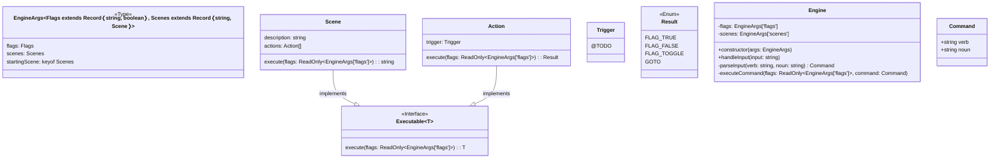

# text-adventure-engine

```mermaid
classDiagram
class EngineArgs~Flags extends Record❬string, boolean❭, Scenes extends Record❬string, Scene❭~ {
  <<Type>>
  flags: Flags
  scenes: Scenes
  startingScene: keyof Scenes
}
class Executable~T~ {
  <<Interface>>
  execute(flags: ReadOnly~EngineArgs['flags']~) : T
}
class Scene {
  description: string
  actions: Action[]
  execute(flags: ReadOnly~EngineArgs['flags']~) : string
}
Scene --|> Executable : implements
class Action {
  trigger: Trigger
  execute(flags: ReadOnly~EngineArgs['flags']~) : Result
}
Action --|> Executable : implements
class Trigger {
  @TODO
}
class Result {
  <<Enum>>
  FLAG_TRUE
  FLAG_FALSE
  FLAG_TOGGLE
  GOTO
}
class Engine {
  -flags: EngineArgs['flags']
  -scenes: EngineArgs['scenes']
  +constructor(args: EngineArgs)
  +handleInput(input: string)
  -parseInput(verb: string, noun: string) Command
  -executeCommand(flags: ReadOnly~EngineArgs['flags']~, command: Command)
}
class Command {
  +string verb
  +string noun
}
```
