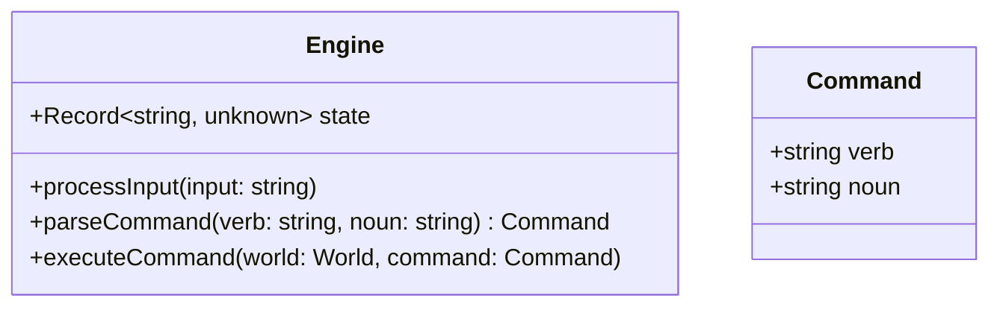

# text-adventure-engine

```mermaid
classDiagram
class Engine {
  +Record~string, unknown~ state
  +processInput(input: string)
  +parseCommand(verb: string, noun: string) Command
  +executeCommand(world: World, command: Command)
}
class Command {
  +string verb
  +string noun
}
```
